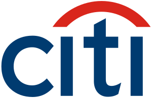

# QuizTok 🎮 — Citi Team Fun Quiz Platform

<div align="center">



**A fully-offline, animated, gamified live-quiz platform built with Python + Streamlit**

[](https://www.python.org/downloads/)
[](https://streamlit.io)
[](https://opensource.org/licenses/MIT)

*Citi-branded, Kahoot-style energy with 2,000-question banking-domain library*

</div>

---

## ✨ Features

### 🎯 Core Gameplay
- **Live Multiplayer Quiz**: Real-time quiz competitions with 6-digit PIN-based joining
- **Multiple Question Types**: MCQ with speed bonuses + subjective rounds with peer voting
- **Team Battles**: Compete individually or form teams (Red Phoenix 🔴, Blue Titans 🔵, Green Warriors 🟢)
- **Smart Scoring**: Time-based bonus points, 🔥 streak multipliers, voting rewards
- **Bot Players**: Practice with AI opponents when playing solo

### 🎨 User Experience
- **Citi Brand Colors**: Professional design with Citi Blue (`#003b70`), Bright Blue (`#0088ce`), Red Arc (`#e21836`)
- **Smooth Animations**: CSS keyframe animations, confetti effects, countdown timers
- **Avatar System**: Choose from 8+ emojis for player representation
- **Real-time Lobby**: Live participant list with avatar selection
- **Podium & Awards**: Animated victory screens with "Funky Awards" (Speed Demon, Streak Master, etc.)

### 🏢 Banking Domain Content
- **2,000+ Questions**: Comprehensive question bank covering:
  - Banking Fundamentals
  - Financial Regulations
  - Digital Banking & Fintech
  - Risk Management
  - Compliance & Security
  - Market Knowledge
  - Corporate Banking
  - And more...

### 📊 Admin Features
- **Quiz Builder**: Create custom quizzes with MCQ and subjective questions
- **Live Quiz Hosting**: Control game flow, see real-time responses
- **Excel-based Storage**: All data (users, quizzes, results, logs) saved locally
- **Activity Logging**: Complete audit trail of all system activities
- **User Management**: Add/edit admin users with secure password hashing

### 🔒 Security & Data
- **Offline-First**: No internet required at runtime - fully local operation
- **Password Security**: SHA-256 hashed passwords
- **Excel Storage**: Simple, portable data storage (users.xlsx, quizzes.xlsx, results.xlsx)
- **Activity Audit**: Comprehensive logging to activity_log.xlsx

---

## 🚀 Quick Start

### Prerequisites
- Python 3.8 or higher
- pip (Python package installer)

### Installation

```bash
# Clone the repository
git clone https://github.com/rajatrajgupta73/QuizTok.git
cd QuizTok

# Install dependencies
pip install -r requirements.txt

# Run the application
streamlit run app.py
```

The app will open automatically at **http://localhost:8501**

### Default Credentials
- **Admin Email**: `admin@citi.com`
- **Admin Password**: `citi123`

---

## 🕹️ How to Play

### For Participants

1. **Join Game**
   - Open the app at http://localhost:8501
   - Enter the 6-digit PIN provided by the host
   - Choose your nickname and optional team
   - Select an avatar in the lobby

2. **Play Quiz**
   - Answer MCQ questions quickly for time bonuses
   - Build streaks (3+ correct) for 2x points
   - Type creative answers for subjective rounds
   - Vote for best answers in voting phase

3. **View Results**
   - See final podium (Top 3)
   - Check team battle results
   - Earn Funky Awards (Speed Demon, Streak Master, Voting Champion)

### For Admins/Hosts

1. **Login**
   - Click "Admin/Host? Sign in"
   - Enter admin credentials

2. **Host a Quiz**
   - Navigate to Quiz Library
   - Click **Host 🎛️** on any quiz
   - Share the 6-digit PIN with participants
   - Wait for players to join in lobby

3. **Run the Game**
   - Click **🚀 LAUNCH GAME** when ready
   - Monitor live responses
   - Game auto-progresses through questions
   - View results and award summary at end

### Demo Mode
No other players? Use **🤖 Play Solo Demo vs Bots** from the login page!

---

## 📁 Project Structure

```
QuizTok/
├── app.py                      # Entry point & page router
├── config.py                   # Configuration (paths, colors, game rules)
├── requirements.txt            # Python dependencies
├── README.md                   # This file
│
├── .streamlit/
│   └── config.toml            # Streamlit theme configuration
│
├── assets/
│   └── citi_logo.svg          # Citi logo for branding
│
├── core/                       # Business Logic Layer (No UI)
│   ├── __init__.py
│   ├── auth.py                # Admin authentication (SHA-256)
│   ├── game.py                # Live game engine, scoring, voting, bots
│   ├── logger.py              # Activity logging system
│   ├── question_bank.py       # 2000-question bank generator
│   ├── seed.py                # Initial data seeding
│   └── storage.py             # Excel storage layer (CRUD operations)
│
├── ui/                         # Presentation Layer (Streamlit)
│   ├── __init__.py
│   ├── theme.py               # CSS injection, animations, Citi branding
│   ├── components.py          # Reusable UI components (logo, podium, timer)
│   ├── login_page.py          # Participant join + admin sign-in
│   ├── lobby_page.py          # Pre-game lobby with live participants
│   ├── quiz_page.py           # Main game screen (MCQ & subjective)
│   ├── results_page.py        # Post-game podium & awards
│   ├── admin_page.py          # Admin dashboard (user/quiz management)
│   └── host_page.py           # Host control panel (live monitoring)
│
├── data/                       # Excel Storage (Auto-generated)
│   ├── users.xlsx             # Admin users
│   ├── quizzes.xlsx           # Quiz definitions
│   ├── question_bank.xlsx     # Master question library (2000+)
│   ├── results.xlsx           # Game results & statistics
│   └── activity_log.xlsx      # System audit log
│
└── prototype/                  # Original HTML/CSS prototypes
    ├── index.html
    ├── admin.html
    ├── host.html
    ├── lobby.html
    ├── quiz.html
    ├── results.html
    └── css/
        └── styles.css
```

---

## 🏦 Question Bank (2,000 Questions)

The app auto-generates a comprehensive banking-domain question bank in `data/question_bank.xlsx` on first run:

| Category | Content |
|---|---|
| **Banking Operations** | KYC/AML, payments (RTGS/NEFT/UPI/SWIFT), clearing, controls, chargebacks |
| **KPI & Metrics** | AHT, FCR, NPS, CSAT, SLA, occupancy, shrinkage + calculation questions |
| **Customer Service** | CRM, VOC, empathy, escalation, closed-loop feedback, scenarios |
| **Self-Service & Digital** | Chatbots, containment/deflection, e-KYC, omnichannel |
| **IVR** | DTMF/ASR/TTS/NLU, routing, containment, courtesy callback, VUI |
| **Agent Assist & LLM** | RAG, prompts, hallucination, guardrails, auto-QA, summarization |
| **Subjective (Vote Rounds)** | Open-ended prompts scored by participant votes |

**Features:**
- Admins can filter by category, difficulty, or search keywords
- Create custom quizzes from filtered selections in one click
- Add subjective voting rounds to any quiz
- Excel file is editable - add your own questions instantly

---

## 🗳️ Subjective Voting Rounds

Unique feature where creativity meets competition:

1. **No Correct Answer**: Subjective questions have no predefined answer
2. **Creative Responses**: Everyone types their own answer
3. **Peer Voting**: All participants vote for the best answer (can't vote for yourself)
4. **Points System**:
   - **300 points per vote** received
   - **500 bonus points** for the winner
   - Counts toward both individual podium and team battle
5. **Awards**: Most-voted player earns the 🗳️ *Crowd Favourite* award

---

## 📊 Data & Logging

All data is stored locally in Excel files for easy access and portability:

### Activity Log (`activity_log.xlsx`)
Complete audit trail with timestamps:
- User logins (admin/participant)
- Game joins and lobby actions
- Every answer submitted
- All votes cast
- Host actions (launch, advance questions)

### Results Storage (`results.xlsx`)
Three comprehensive sheets:
- **Games**: Quiz metadata, timing, participant counts
- **Scores**: Final standings with teams, points, votes, and awards
- **Answers**: Every response with vote counts, timing, and points earned

### Other Data Files
- **users.xlsx**: Admin accounts with hashed passwords
- **quizzes.xlsx**: Quiz definitions and question mappings
- **question_bank.xlsx**: Master 2,000+ question library
- **live_game.json**: Real-time game state (shared across browser tabs)

---

## 🎨 Technical Highlights

### Architecture
- **Clean Separation**: Business logic (core/) separate from UI (ui/)
- **Streamlit-based**: Modern Python web framework with reactive UI
- **Excel Storage**: No database required - portable and editable
- **Session State**: Multi-tab support with live synchronization

### Performance
- **Offline-First**: No internet dependency at runtime
- **Local Assets**: All CSS, fonts, and styling embedded
- **Fast Loading**: Cached resources with @st.cache_resource
- **Real-time Updates**: Automatic page refresh for live game state

### Security
- **Password Hashing**: SHA-256 for admin credentials
- **No Sensitive Data**: All data stored locally
- **Activity Auditing**: Complete action logging
- **Session Isolation**: Each game has unique PIN-based access

---

## 🚦 Configuration

Edit `config.py` to customize:

### Branding
```python
CITI_BLUE = "#003b70"
BRIGHT_BLUE = "#0088ce"
RED_ARC = "#e21836"
```

### Game Rules
```python
SCORE_CORRECT = 1000          # Base points for correct answer
TIME_BONUS_MAX = 300          # Max bonus for fast answers
STREAK_BONUS_THRESHOLD = 3    # Answers needed to trigger streak
STREAK_MULTIPLIER = 2.0       # Points multiplier during streak
VOTING_POINTS_PER_VOTE = 300  # Points per vote received
VOTING_WINNER_BONUS = 500     # Bonus for most-voted answer
```

### Teams
```python
TEAMS = [
    {"name": "Red Phoenix", "color": "#e74c3c", "emoji": "🔴"},
    {"name": "Blue Titans", "color": "#3498db", "emoji": "🔵"},
    {"name": "Green Warriors", "color": "#2ecc71", "emoji": "🟢"}
]
```

---

## 🛠️ Development

### Tech Stack
- **Python 3.8+**
- **Streamlit 1.39+**: Web framework
- **Pandas 2.0+**: Data manipulation
- **OpenPyXL 3.1+**: Excel file operations

### Adding Questions
1. Open `data/question_bank.xlsx` in Excel
2. Add rows with: question, options (A/B/C/D), correct answer, category, difficulty
3. Save - questions are immediately available

### Customizing UI
- **Theme**: Edit `.streamlit/config.toml` for colors
- **CSS**: Modify `ui/theme.py` for animations and styling
- **Components**: Update `ui/components.py` for UI elements

### Creating Quizzes
Two methods:
1. **In-App**: Use Admin Dashboard → Quiz Builder
2. **Direct Excel**: Edit `data/quizzes.xlsx` (requires question_id references)

---

## 📈 Future Enhancements

Potential features for future development:
- [ ] Export results to PDF reports
- [ ] Question images/diagrams support
- [ ] Timer customization per question
- [ ] Multi-language support
- [ ] Sound effects and background music
- [ ] Mobile-responsive optimizations
- [ ] Question categories analytics
- [ ] Player performance history
- [ ] Custom team creation
- [ ] Integration with external question banks

---

## 🤝 Contributing

Contributions are welcome! Please feel free to:
1. Fork the repository
2. Create a feature branch (`git checkout -b feature/AmazingFeature`)
3. Commit your changes (`git commit -m 'Add some AmazingFeature'`)
4. Push to the branch (`git push origin feature/AmazingFeature`)
5. Open a Pull Request

---

## 📄 License

This project is licensed under the MIT License - see the LICENSE file for details.

---

## 👤 Author

**Rajat Raj Gupta**
- GitHub: [@rajatrajgupta73](https://github.com/rajatrajgupta73)
- Email: rajatrajgupta73@gmail.com

---

## 🙏 Acknowledgments

- Inspired by Kahoot! gameplay mechanics
- Built for Citi team engagement and training
- Designed for offline banking domain knowledge assessment

---

## 📞 Support

For issues, questions, or suggestions:
- Open an issue on GitHub
- Contact: rajatrajgupta73@gmail.com

---

<div align="center">

**Made with ❤️ for Citi Team Learning**

⭐ Star this repo if you find it helpful!

</div>
